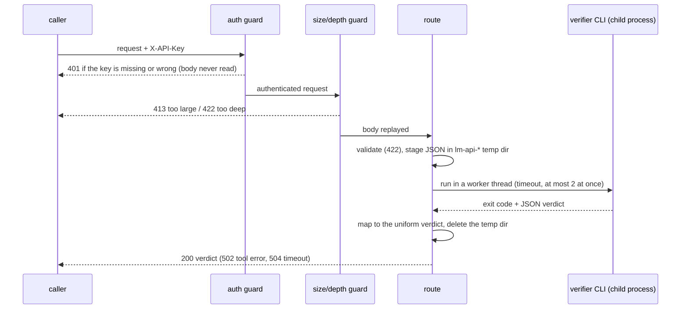
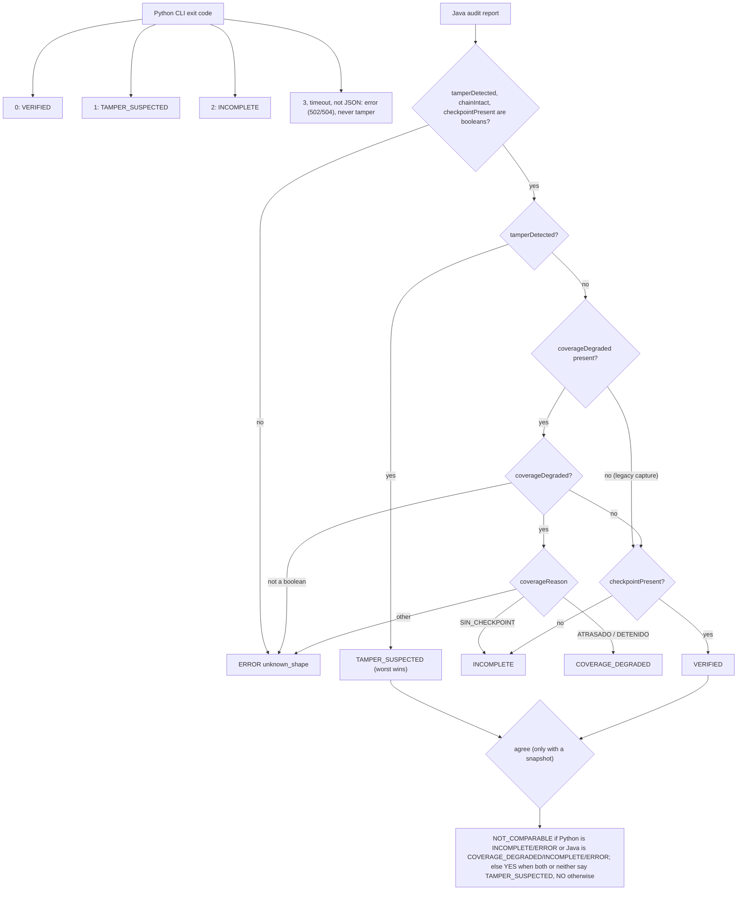

# ledger-verification-agent

**Read-only.** This agent can answer questions about a double-entry ledger and it
can **never move money**: every tool it is allowed to call is a read, and the
verdict is produced by a deterministic Python checker, not by the model.

> **PHASE 0 + PHASE 1 - this is not the shipping README.** The repository holds the
> Phase-0 gate (preflight evidence, a recorded and a source-derived fixture corpus,
> the read-only tool registry as declarative metadata, the guards that protect the
> Java ledger from being written to) **and the Phase-1 deterministic verifier**.
> There is still **no agent loop, no model client and no HTTP client**. Phase 2 (agent loop,
> evals, CI) is a planned addition after 2026-10-28, on a simulated model at zero cost; the
> verifier and the FastAPI service are complete. An **optional
> FastAPI service** now exists in `ledgermind_api/` (API Run A): it runs the verifier
> CLI behind an API key, binds 127.0.0.1:8088 by default, and sits outside the verifier
> package. API Run B added the Java audit route, a Dockerfile, a committed
> `docs/openapi.json` and a runbook; any AI model is still missing. The full README (diagrams, quickstart, evals, LIMITS,
> the reuse disclosure) is a Phase-4 deliverable.
> Short commit ids cited in test docstrings and `docs/evidence/` point to the development history,
> which is not published here; this repository starts from a single export commit.

## What it will be

A FastAPI service with one endpoint, `POST /ask`: a natural-language question about
the ledger goes in; `{answer, verdict, citations[], tool_calls[]}` comes out. A
bounded tool-use loop on the raw Anthropic Messages API - no agent framework - calls
allow-listed read tools against [LedgerMind](https://github.com/juanfranpaezz/ledgermind),
a Java double-entry payments core. A deterministic Python checker then proves money
conservation, no-overdraft and hash-chain continuity, and **it** produces the verdict.

## Current state, honestly

| Phase | What | State |
|-------|------|-------|
| P0.0 | Preflight (Docker / Python / JDK 21) | run; the first pass aborted with the daemon down, the re-run is green |
| P0.0 | LedgerMind no-write snapshot | taken, guard proven to fire both ways, still `diff_lines: 0` |
| P0.1 | One-command stand-up transcript | recorded in `docs/evidence/standup.txt` |
| P0.2 | Recorded fixture corpus | captured from a running stack; the source-derived corpus stays as the adversarial set |
| P0.3 | Tool-registry count check (AC-0.3) | check **done and proven both ways**; the MCP spike passed |
| P0.4 | Sweep of the project's private notes for false claims about this repository | run privately; that tool and its data are not part of this public repository |
| **P1** | **Deterministic verifier (3 invariants, citations, verdict object)** | **done - see "Phase 1" below** |
| API Run A | Optional FastAPI service over the verifier CLI (`ledgermind_api/`, tests in `tests_api/`) | **done** - runs locally, 127.0.0.1 by default |
| API Run B | Java audit route, Docker image, committed `docs/openapi.json`, runbook | **done** - see "FastAPI service (optional)" |
| P2+ | Agent loop, evals, CI, docs | **not started** - a planned addition after 2026-10-28, on a simulated model at zero cost |

## Run what exists

```
py -m pytest                                  # 384 tests, no network, no services
py -m tools.verify_report --corpus recorded --half clean --corpus-root <dir>  # a corpus outside the repo
py -m tools.verify_report --corpus recorded --half clean      # exit 0, verdict OK
py -m tools.verify_report --corpus recorded --half tampered   # exit 1, verdict TAMPERED
py -m tools.fixture_report --corpus derived   # exits 1 on purpose: not an AC-0.2 corpus
py tools/derive_fixtures.py               # regenerate the source-derived corpus
```

On Windows use the `py` launcher, as in the commands above: a bare `python` can resolve to the
Microsoft Store alias stub, which does not run. On Linux or macOS, use `python3`.

The suite needs no network, no Docker and no LedgerMind. It has no runtime
dependencies at all; `pytest` is the only dev dependency.

## Phase 1: deterministic verifier

**What exists.** A pure-Python checker that proves three invariants over a ledger
snapshot and returns a structured verdict with citations. No model is involved at any
point - this layer *is* the thing that decides, and Phase 2's model may only narrate
what it decided.

| Check | What it proves | Legs it actually runs |
|-------|----------------|-----------------------|
| `money_conservation` | money is neither created nor destroyed | per-transfer legs balance; the ledger's account counters equal a replay of every posting; system-wide `sum(postedCredits - postedDebits) == 0` |
| `no_overdraft` | no account sits below its floor | now, and at **every step of the replay** (walked in chain order, `posting_hash.seq`, never posting-id order). The floor is 0 only when `allowNegative` is false: `external:funding` legally sits at -158000 and a checker that flags it is useless; an undeclared floor is named, never guessed |
| `hash_chain_continuity` | the journal was not edited after the fact | every link recomputed from `JournalChainer.entryHash`; the signed checkpoint still anchors its head; and a cross-check against LedgerMind's own `/api/journal/verify` |

Each violation carries `citations[]` naming the exact posting, account or chain link,
and a check whose input is missing returns `NO_DATA` - never a silent pass. The
top-level verdict is `OK`, `TAMPERED` or `INCOMPLETE`, and `INCOMPLETE` can never mask
a violation.

**What this checker covers, scoped exactly: SNAPSHOT-TIME checking, and nothing wider.**
Its entire input is state LedgerMind has already persisted - postings, posting hashes,
account counters, account views and the signed checkpoint. Over that state it checks more
than the Java's own `audit()` does, which only walks the chain and the signature. But
"more than `audit()` over a snapshot" is **not** "everything the Java system checks", and
the difference is structural, not a gap someone forgot to fill: **an operation the ledger
REFUSED leaves no snapshot behind.** There are no postings to read, no counters to replay
and no chain link to recompute, so no snapshot-time checker - this one or any other - can
see that the refusal happened, or that it was ever attempted.

Concretely, this instrument does **not** cover the write-time rules LedgerMind enforces at
the moment a transfer is submitted, and never will from a snapshot: **overdraft refusal,
idempotency-key conflict, negative or zero amount, self-transfer, and replay of an already
applied transfer.** (Those are LedgerMind's own write-path rules; this repository does not
re-derive them from the Java source, and it never writes to that system.) Read the
`no_overdraft` row above precisely: it proves no account *sits* below its floor, at rest and
at every step of the replay. It does **not** prove the ledger *rejected* an overdraft
attempt - a ledger that happily allowed one would look identical here if the resulting rows
were then chained and signed consistently. Proving the write path holds needs a test that
submits operations against a running ledger and reads the refusals; that is a different
instrument from this one, and it does not exist in this repository.

```
py -m tools.verify_report --corpus recorded --half tampered
    -> verdict TAMPERED, hash chain breaks at seq=5 after 4 intact links, exit 1
```

**What does NOT exist yet, stated plainly.** There is no agent, no model client, no
Anthropic API call, no HTTP client, no `POST /ask` and no AI model; the optional
FastAPI service lives outside the verifier package, in `ledgermind_api/`. A test
walks the verifier's whole runtime import closure and fails if `anthropic`, `httpx`,
`requests`, `urllib`, `socket`, `subprocess` or `fastapi` appears in it.

**The post-quantum signature.** The checkpoint carries a real ML-DSA-65 (FIPS 204)
signature. This package has zero runtime dependencies, so by default nothing in
process can verify it and the report says exactly that: `UNVERIFIED-SIGNATURE`, with
the reason, never a quiet "valid". What IS always checked without any library: the
signed message is byte-for-byte the canonical string the Java builds, the public key
parses as an X.509 SPKI whose OID is `2.16.840.1.101.3.4.3.18` (id-ml-dsa-65) and
agrees with the declared algorithm, and the key and signature have the ML-DSA-65
sizes.

**A key this checker cannot parse is FAIL-CLOSED (added 2026-09-22).** If the public key in
the checkpoint row is not a readable DER SubjectPublicKeyInfo, the report is
`UNVERIFIED-SIGNATURE` with that stated as the reason, and the CLI exits `2` - even if a
backend would have answered "valid". It used to fall through: a permissive backend could
return True over key bytes that never parsed, the algorithm column then went unchecked
(the term that checks it needs the key's OID, which the failed parse never produced), and
the run reported `VERIFIED`. A checker that cannot read the key has verified nothing. It is
`UNVERIFIED`, never `INVALID`: unreadable is not evidence of forgery, so it does not gate
the verdict - it only refuses to call the run a pass.

**Exit codes, and why `3` exists.** `0` verified, `1` TAMPERED, `2` INCOMPLETE (a verdict
could not be completed - no usable backend, a missing checkpoint on a recorded corpus, an
unreadable key), `3` tool error. Until 2026-09-22 a malformed capture - a `journal_checkpoint.json`
holding `null`, for instance - raised an uncaught `TypeError` and the interpreter exited `1`,
which in this tool means TAMPERED. A broken capture and a detected forgery are not the same
event, and an operator reading exit codes could not tell them apart. Unreadable input is now
`3` in every case; `1` is reserved for a verdict this tool actually reached.

**The CLI auto-selects the OpenSSL >= 3.5 backend when it is present (changed 2026-09-22).**
It used to be opt-in behind `--mldsa-openssl`, and that made the signature leg decorative on
the default command: measured against a real Docker LedgerMind on 2026-09-22, a corpus with
ONE byte of the signature flipped reported `verdict: OK` and exited `0` on a machine that had
a working OpenSSL 3.5.5 installed. Now `py -m tools.verify_report` verifies the signature for
real when it can, and when it genuinely cannot it exits `2` (INCOMPLETE) instead of `0` - the
verdict object still reports `OK` with `UNVERIFIED-SIGNATURE`, because "could not verify" is
not evidence of tamper, but the exit code a gate reads refuses to say pass. `--mldsa-openssl`
now means *require* the backend: it errors out instead of degrading. The library-free
in-process default is unchanged: this package still has zero runtime dependencies.

When a backend does run and the signature does **not** close (`INVALID`), the verdict is
`TAMPERED` and the CLI exits 1 - the same rule as LedgerMind's own `audit()`
(`tampered = !intact || !signatureValid || !signedHeadStillInChain`). `UNVERIFIED-SIGNATURE`
never changes the verdict: "could not verify" is not evidence of tamper. It does change the
exit code, to `2`, for the reason in the paragraph above.

**A MISSING checkpoint is INCOMPLETE on a recorded corpus (added 2026-09-22).** Forging the
signature always fails now; DELETING `journal_checkpoint.json` still exited `0` with a
`NO-CHECKPOINT` note, so removing the evidence was cheaper than forging it - the same
cannot-go-red shape, reached by removal. `--corpus recorded` now exits `2` when the file is
absent, because the recorder always captures `/api/journal/checkpoint` and a recorded corpus
without one is a stripped or broken capture. `--corpus adversarial` still exits `0`: those
fixtures carry no checkpoint by construction, so nothing is missing and there is nothing to
forge. The verdict object is untouched in both cases.

That equivalence with `audit()` is **PARTIAL, and here is the attacker it cannot catch**:
the public key travels in the checkpoint row itself and is anchored nowhere, so anyone with
the database write access this verifier exists to detect can rewrite the postings, re-chain
them, re-sign the new head **with their own key** and write that key into the row - and every
leg, including this gate, goes green. It was reproduced on 2026-09-20 with a freshly generated
ML-DSA-65 keypair. `signatureValid` here is message INTEGRITY, not signer authenticity; the
limit is stated in full in `docs/evidence/phase1-verifier.md` (section 5) and printed at
runtime on every verdict. Real non-repudiation needs a key anchored outside the database,
which Phase 1 does not have.

The **algorithm column IS inside the loop** (fixed 2026-09-22). LedgerMind computes
`signatureValid = algorithmMatches && signer.verify(...)` (`JournalCheckpointService.java:149-150`),
so a DB writer who rewrites only the `algorithm` column - signature and key intact - makes
`audit()` report TAMPERED. This verifier now folds the same term into the signature status, so
it reports `INVALID` and `TAMPERED` on that case too, naming the algorithm as the cause. The
term is narrow on purpose: it fires only when the public key parses and its OID disagrees with
the declared name, so a corpus carrying placeholder key material cannot be flipped to INVALID
by it.

Note that on the tampered corpus the signature still verifies while the chain is
broken. That is correct and is LedgerMind's own documented behaviour: the signature
anchors the head *in time*, and the SHA-256 chain is what betrays an edit. They are
separate planes and conflating them destroys information; only a signature proven
INVALID crosses from its plane into the verdict.

## FastAPI service (optional)

A local HTTP service over the same verifier. It is **Python + FastAPI, not an AI**: no model
is called anywhere in it, and it never calls the Java ledger either. Step-by-step commands
(keys, start, curl, Docker) are in [`docs/RUNBOOK-ledgermind-api.md`](docs/RUNBOOK-ledgermind-api.md);
the machine-readable contract is [`docs/openapi.json`](docs/openapi.json).

- **Install**: `py -m pip install -e ".[api]"` (the `api` extra; the verifier core keeps
  `dependencies = []`). Start with `py -m ledgermind_api`; it binds `127.0.0.1:8088`.
- **Auth**: every route, including `/openapi.json` and `/docs`, needs the `X-API-Key` header.
  Keys are stored as sha256 hashes in the file named by `LEDGERMIND_API_KEYS_FILE`
  (`py -m ledgermind_api.keygen --id <name>` creates one); without a valid keys file the
  service refuses to start.
- **Limits**: body over `LEDGERMIND_API_MAX_BODY_BYTES` (default 1 MiB) is 413, JSON nested
  deeper than 64 is 422, a body that has not arrived in full within `LEDGERMIND_API_BODY_TIMEOUT_S`
  (default 10 s) is 408, at most 2 verifier runs at once, 60 s per run (then 504).
- **Routes**: `GET /v1/health`; `POST /v1/verify/corpus` (a registered corpus, by id);
  `POST /v1/verify/snapshot` (an uploaded snapshot, as JSON content); `POST /v1/java/audit`
  (interprets the Java ledger's own `verify_journal_integrity` report; with an optional
  snapshot it also runs the Python verifier and says whether the two `agree`);
  `GET /v1/tools` (the catalog an agent would call). Any verdict is HTTP 200: the verdict is data.
- **Container**: `Dockerfile` builds a non-root image; the keys file is mounted read-only at
  run time, never copied in. Publish it on 127.0.0.1 only.

**Honest limits.** The verdict is about the uploaded snapshot, not the live ledger. VERIFIED is
not "ledger intact": it means no evidence of what the checks detect. The provenance of an
uploaded snapshot or audit is not authenticated, so `agree` compares two readings of whatever
was uploaded. There is no TLS. There is no AI model in this phase. Phase 2 (agent loop, evals,
CI) is a planned addition after 2026-10-28, on a simulated model at zero cost; the verifier and
the FastAPI service are complete.

### Where the process boundary is


### One request, in order



### How a verdict is decided



## Layout

```
src/ledger_verification_agent/
    spike_state.py            reads the MCP-spike verdict from its evidence file; fails closed
    tool_registry.py          the declarative read-only tool surface (metadata only)
    verdict.py                the structured verdict object Phase 2 will serialise
    journal_chain.py          SHA-256 chain, re-derived from JournalChainer.java
    ledger_snapshot.py        loads a corpus + declares which read-only tool serves each dataset
    checkpoint_signature.py   canonical message, SPKI structure, pluggable ML-DSA backend
    deterministic_verifier.py the three checks and check_all()
    mldsa_openssl_backend.py  OPT-IN only; never imported by the verifier
tools/
    compare_corpora.py      the derived-vs-recorded oracle, at the precision the Java actually emits
    derive_fixtures.py      recomputes the demo ledger and its real SHA-256 chain from Java source
    fixture_report.py       AC-0.2's checker; refuses any corpus that was not recorded
    ledgermind_snapshot.py  the no-write guard over the Java checkout
    record_fixtures.py      AC-0.2's recorder: captures the corpus from a RUNNING LedgerMind; every write re-checked at its write site
    verify_report.py        Phase-1 CLI over check_all()
tests/
    fixtures/derived_from_source/   computed corpus: clean, tampered, 6 adversarial cases
    fixtures/recorded/              the real captured corpus (clean + tampered halves)
docs/evidence/                      every acceptance-criterion artefact
ledgermind_api/                     the optional FastAPI service (outside the verifier package)
    app.py                    guards, request models, routes
    runner.py                 runs the CLI in a child process, stages uploads, Python verdict mapping
    java_audit.py             Java audit-report mapping and the agree differential
    config.py / keygen.py     settings (fail-closed) and API-key creation
    openapi_export.py         writes docs/openapi.json
tests_api/                          the service's tests (need the api-test extra); golden/java/ = Java mapping rows
docs/openapi.json                   the committed API contract (a test fails on drift)
docs/RUNBOOK-ledgermind-api.md      keys, start, calls, Docker - command by command
Dockerfile, .dockerignore           non-root image; keys mounted at run time, never copied in
```

## The Java ledger is read-only to this project

Nothing in this repository writes to the LedgerMind checkout, and that is enforced
rather than promised. `tools/ledgermind_snapshot.py` records `git status --porcelain`
with `target/` excluded, plus SHA-256 of every tracked file under `src/`, `pom.xml`,
both compose files and the `Dockerfile` (62 files today). Comparing the before and
after snapshots detects an uncommitted edit, a content change and a new stray file -
none of which a commit count can see. The `target/` exclusion is narrow and named:
running the app writes build output there, and a guard that a legitimate step trips
is a guard someone weakens under pressure.

## License

Apache-2.0 - see [`LICENSE`](LICENSE).
